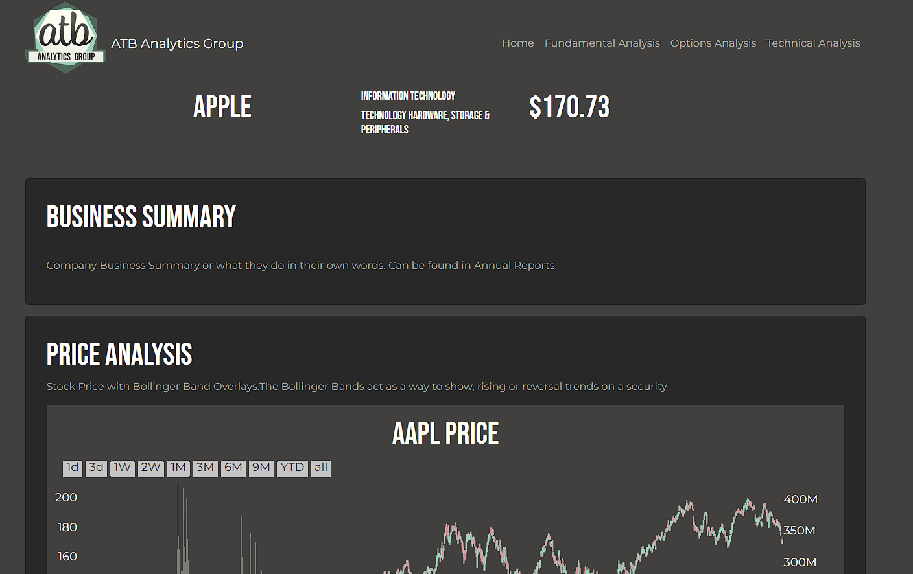

Simple S&P500 Screener
---
***

## Application Purpose

***
Utilize Python, yFinance and/or similar API's and financial data packages, TA-LIB, and Plotly Dash, this is intended to be a simple 
multipage stock screener that helps increase your knowledge about fundamental, technical, and option investing through
data visualization and analysis.

## Motivation

***
To find stocks on the S&P500 that match a desired pattern, and see if there is an investment opportunity. 

I built this
to strip out all the various things in larger and more commercial screeners that are not relevant to my investment level 
and skillset. This is not intended to be a tool to be used for actual investments, but as a startging point to learn 
how to identify trends and start to get an understanding of visualizing and manipulating 
financial datasets pertaining to the stock market.

## Lessons Learned

***

1. Candlestick Analysis using Python and TA-Lib

2. Multi-Page Plotly Dash
    1. Homepage
    2. Fundamental Analysis
    3. Technical Analysis
    4. Options Analysis
    5. #### Planned Pages
        ~~1. Options Page - Currently at the bottom of both Technical and Fundamentals Pages~~
        2. Stock vs Top N Stocks within 
           1. Industry
           2. S&P500

4. Calling API Service
    1. yFinance  
5. Database Development
    1. SQLite - this was the smallest and most lightweight to get up and running
6. Interactive Data Visualization
   1. Plotly Dash

## Features

***

* Search Candlestick Patterns to identify potential investment opportunities.
* Fundamental Analysis comparing Stocks to Industry
* Technical Analysis
    * Bollinger Bands
    * Moving Averages
        * 50MA
        * 72MA
        * 200MA
    * On Balance Volume
    * Average True Range
    * Moving Average Convergence - Divergence

### Planned Features/Enhancements

***

* Better UI/UX flow
* Top ROI by Sector and/or Stock
* Machine Learning
* Pulling in RSS Feeds/insider trading information
* Job Scheduling for Daily Updates
* Possible Hosting on Heroku/Other Platform.

